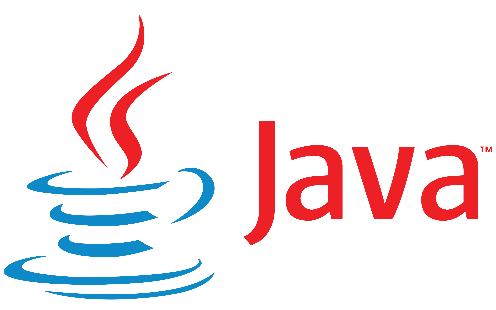

#  Hello, my name is [Soohwan Jeon] 

## About Me 
Hi! my name is Soohwan and I'm senior and my major is computerscience.
---

##  Programming
My favorite language is **Java**.

> I like Java the most because I feel like java is easiest programming language to use.

---

##  Picture


---

##  Links
- [Google](https://www.google.com)

---

##  Section Link
[Go to Programming Section](#programming)

---

##  Relative Link
[README file](README.md)

---

### Unorder List
- A
- B
- C

### Order List
1. A
2. B
3. C

## Task List
- [x] A
- [x] B
- [ ] C

---

##  Code Example
```java
public class Hello {
    public static void main(String[] args) {
        System.out.println("Hello World");
    }
}
```

---


